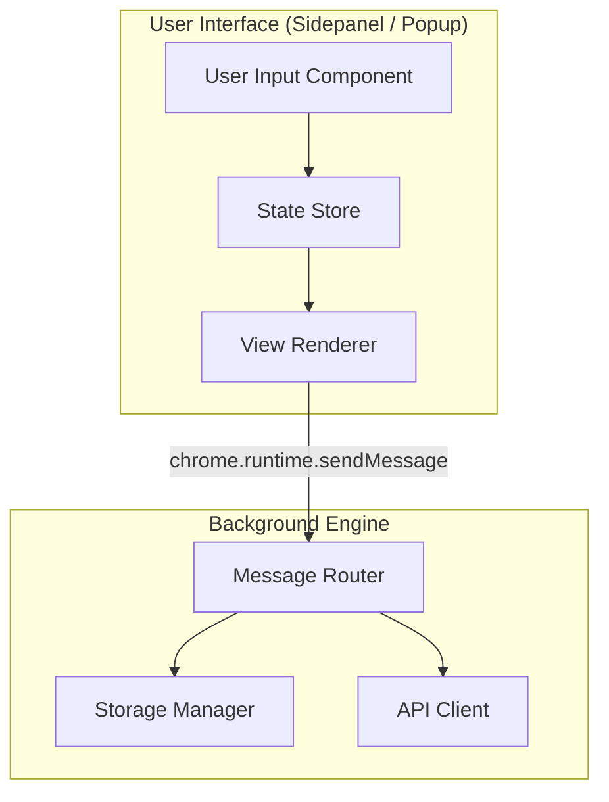
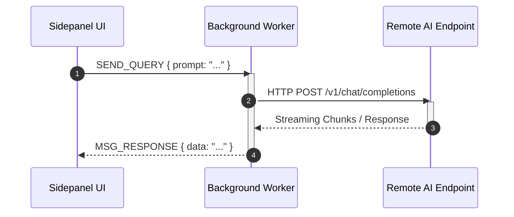
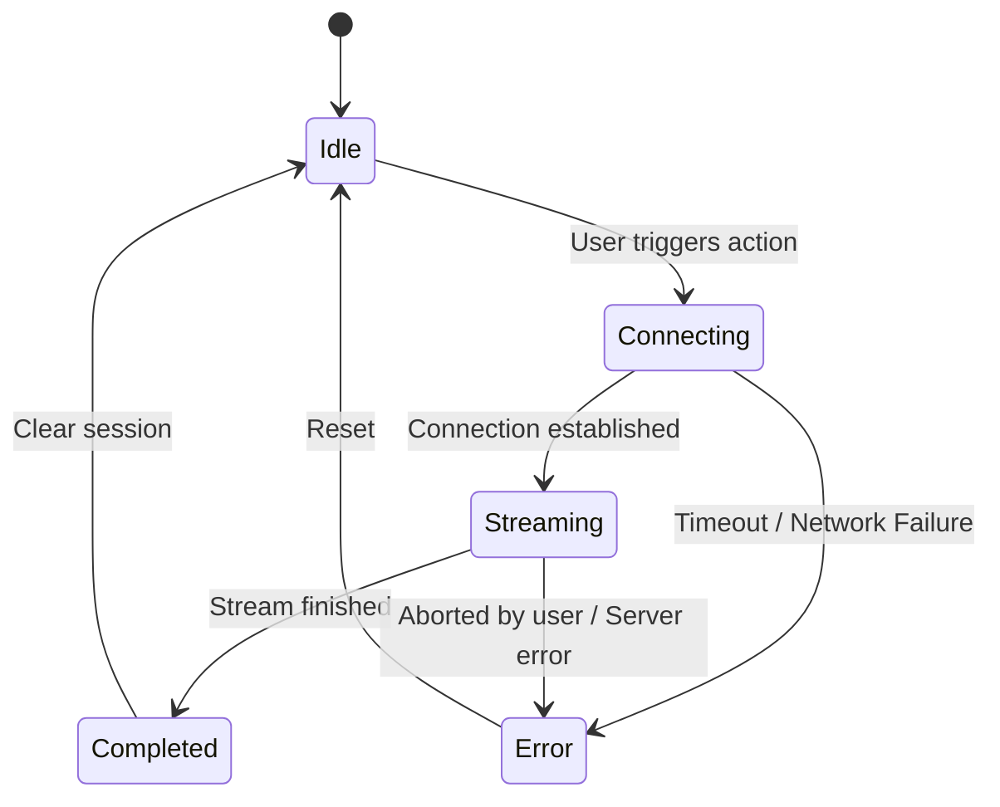

# Mermaid Diagrams Skill

This skill provides syntax rules, formatting standards, and templates for rendering bug-free Mermaid diagrams.

---

## 1. Syntax Guardrails & Common Pitfalls

To ensure diagrams render reliably without parser errors:

1. **Quote Node Labels with Special Characters**:
    - Always wrap node labels containing parentheses `()`, brackets `[]`, colons `:`, slashes `/`, or spaces in double quotes.
    - **Correct**: `A["Service Worker (Background)"] --> B["Content Script"]`
    - **Incorrect**: `A[Service Worker (Background)] --> B[Content Script]`
2. **Avoid Raw HTML Tags in Labels**:
    - Do not include `<b>`, ``, ` ` unless strictly supported and tested. Use markdown-compatible plain text.
3. **Use Standard Layout Orientations**:
    - `TD` or `TB`: Top-to-bottom (ideal for hierarchal architecture or decision trees).
    - `LR`: Left-to-right (ideal for pipelines, lifecycle stages, and sequential data flows).

---

## 2. Common Diagram Templates

### Architecture & Data Flow (Flowchart TD/LR)

### Async Message Sequence (Sequence Diagram)

### State Machine (State Diagram)

---

## 3. Review Checklist

- [ ] Are all complex strings enclosed in `"quotes"` inside node brackets?
- [ ] Is diagram direction (`TD`, `LR`) appropriate for readability?
- [ ] Are subgraph names and identifiers clean without spaces in IDs (use IDs with quotes: `subgraph ID ["Label"]`)?
